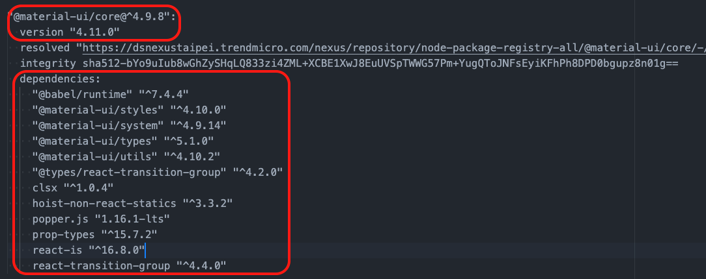

## ReactJS

[React](https://reactjs.org/) is a JavaScript library for building user interfaces, an open-source project created by Facebook, it can be used as a base in the development of single page or mobile applications.

React is only concerned with **rendering data to the DOM**, it is the **view** layer of an MVC application (Model View Controller), so creating React applications usually requires the use of additional libraries for state management(ex: Redux) and routing(ex: React Router).

One of the most important aspects of React is that you can create **components**, which are like **custom, reusable HTML elements**, to quickly and efficiently build user interfaces.

## Single Page Application

A [single-page application (SPA)](https://en.wikipedia.org/wiki/Single-page_application) is a web application or website where each new page's content is served **not from loading new HTML pages but generated dynamically through JavaScript's ability to manipulate the DOM elements** on the existing page itself.

It loads a single HTML page and all the necessary assets (such as JavaScript and CSS) required for the application to run. Any interactions with the page or subsequent pages do not require a round trip to the server which means the page is not reloaded. **Only data is transmitted back and forth**.

## Virtual DOM -- Fighting Wasteful DOM Manipulation

DOM manipulation is the heart of the modern, interactive web. Unfortunately, it is also a lot slower than most JavaScript operations.

In React, for every DOM object, there is a **corresponding virtual DOM object**. A virtual DOM object is a representation of a DOM object, like a lightweight copy.

[Virtual DOM](https://reactjs.org/docs/faq-internals.html) object has the same properties as a real DOM object, but **it lacks the real thing’s power to directly change what’s on the screen**.

Manipulating the DOM is slow. Manipulating the virtual DOM is much faster, because nothing gets drawn onscreen. Think of manipulating the virtual DOM as editing a blueprint, as opposed to moving rooms in an actual house.

### How Virtual DOM Helps in React

1. When the state of a component changes, React updates the virtual DOM tree.

2. Once the virtual DOM has been updated, **React then compares the current version of the virtual DOM with the previous version of the virtual DOM**. This process is called **diffing**.

3. The changed objects, and **the changed objects only**, get updated on the real DOM for re-rendering of the UI.

## Node.js package managers - Yarn vs npm vs npx

Package Manager is essentially a way to **automate the process of installing, updating, configuring, and removing pieces of software (AKA packages) retrieved from a private or global registry**.

[Yarn](https://yarnpkg.com/) was developed by Facebook in attempt to resolve some of npm’s shortcomings. Think of Yarn as a new installer that still relies upon the same npm structure and npm modules. The registry itself hasn’t changed, but the installation method is different.

### Speed

**Yarn uses and stores all the packages that were installed in your local cache**. When you are installing the package, Yarn is looking for the package in the local cache, and if the package is not found, then Yarn tries to download it from the Internet. It also **parallelizes operations** to maximize resource utilization so install times are faster than ever.

### yarn.lock

To **ensure that the same package is installed throughout all devices**, Yarn needs more information than the dependencies you configure in your package.json. Yarn needs to store exactly which versions of each dependency were installed, this reduces the possibility of bugs from having different versions installed.

[npx](https://github.com/npm/npx) is a npm package runner (x stands for eXecute). A major advantage of npx is the ability to execute a package which wasn't previously installed. It doesn't matter whether you installed that package globally or locally, **npx will temporarily install it and run it**.

## Package.json

**This file holds various metadata relevant to the project and normally located at the root directory**. This file is used to give information to package manager that allows it to identify the project as well as handle the project's dependencies. It can also contain other metadata such as a project description, the version of the project in a particular distribution, license information, even configuration data.

&nbsp;&nbsp;&nbsp;&nbsp;&nbsp;&nbsp;`yarn init` This command walks you through an interactive session to create a [package.json](https://docs.npmjs.com/files/package.json) file.

### install

`yarn install` is used to install all dependencies for a project and put them to **node_modules** folder. This is most commonly used when you **have just checked out code for a project, or when another developer on the project has added a new dependency that you need to pick up**.

### dependencies vs devDependencies, caret(^) vs tilde(~)

&nbsp;&nbsp;&nbsp;&nbsp;&nbsp;&nbsp;[dependencies](https://docs.npmjs.com/specifying-dependencies-and-devdependencies-in-a-package-json-file): Packages required by your application in production.

&nbsp;&nbsp;&nbsp;&nbsp;&nbsp;&nbsp;devDependencies: Packages that are only needed for local development-only. For example testing packages, webpack, Babel or eslint.

&nbsp;&nbsp;&nbsp;&nbsp;&nbsp;&nbsp;`yarn add <package...>` for dependencies

&nbsp;&nbsp;&nbsp;&nbsp;&nbsp;&nbsp;`yarn add <package...> [--dev/-D]` for devDependencies

&nbsp;&nbsp;&nbsp;&nbsp;&nbsp;&nbsp;[^version](https://stackoverflow.com/questions/22343224/whats-the-difference-between-tilde-and-caret-in-package-json): **Compatible with version**, will update you to all future minor/patch versions, without incrementing the major version. ^2.3.4 will use releases from 2.3.4 to <3.0.0.

&nbsp;&nbsp;&nbsp;&nbsp;&nbsp;&nbsp;~version: **Approximately equivalent to version**, will update you to all future patch versions, without incrementing the minor version. ~1.2.3 will use releases from 1.2.3 to <1.3.0.

### scripts

[Scripts](https://docs.npmjs.com/misc/scripts) are a great way of automating tasks related to your package, such as simple build processes or development tools. Using the scripts field, where you define json like key value script, key is the command name which you will use to run and value is the command you want to run. You can install any NPM module locally and run the scripts command as if it were global.

&nbsp;&nbsp;&nbsp;&nbsp;&nbsp;&nbsp;`yarn run <script>`

