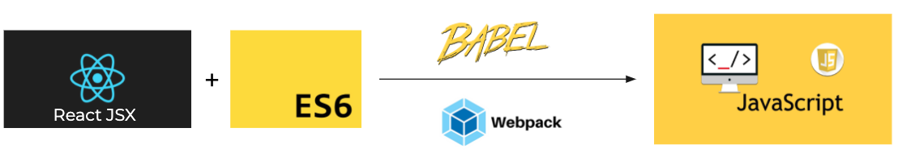
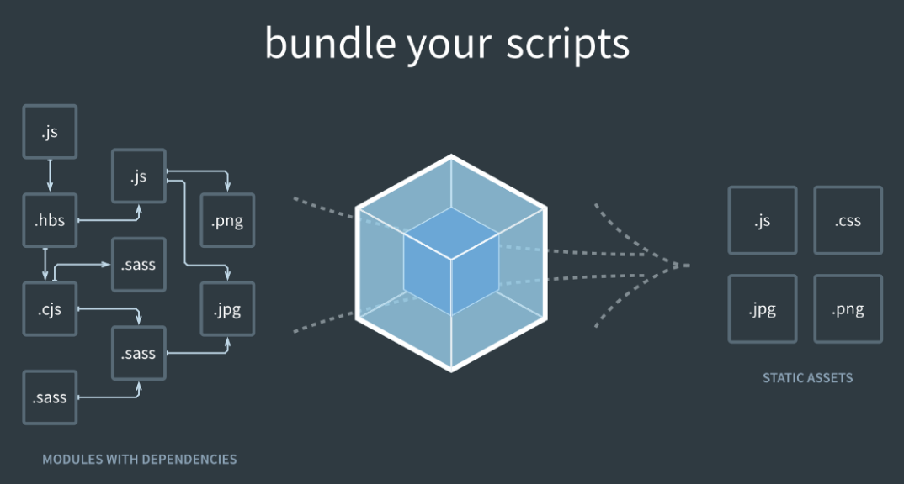

## React Directly in Static HTML File

```javascript
<!DOCTYPE html>
  <title>React in HTML</title>
  <script src="https://unpkg.com/react@16/umd/react.production.min.js"></script>
  <script src="https://unpkg.com/react-dom@16/umd/react-dom.production.min.js"></script>
  <script src="https://unpkg.com/babel-standalone@6.15.0/babel.min.js"></script>
  <body>
    <div id="root"/>
    <script type="text/babel">
      class Hello extends React.Component {
        render() {
          return <h1>Hello React</h1>
        }
      }
      ReactDOM.render(<Hello />, document.getElementById("root"));
    </script>
  </body>
</html>
```

- React: the React top level API

- React DOM: provides DOM-specific methods that can be used at the top level of your app

- Babel: a JavaScript compiler that lets us use **ES6+** in old browsers, the script type **text/babel** is mandatory for using Babel

- To define a React class component, you need to extend **React.Component**. The only required method in a React class component is `render()` method, which returns **JSX**

- `ReactDOM.render(element, container)` - Render a React element into the DOM in the supplied container

## JSX

```javascript
const element = <h1>Hello, world!</h1>;
```

- [JSX](https://reactjs.org/docs/introducing-jsx.html) is neither a string nor HTML, it is a XML-like syntax extension to JavaScript. The syntax is intended to be used by preprocessors (i.e., transpilers like **Babel**) to transform into standard JavaScript objects that a JavaScript engine will parse.

- JSX is not a requirement for using React, but JSX makes it easier to write React applications.

- **className** is used instead of class for adding CSS classes, as class is a reserved keyword in JavaScript.

- Properties and methods in JSX are **camelCase** - tabindex becomes tabIndex, onclick becomes onClick.

- Self-closing tags must end in a slash - e.g. ``, `<MyComponent />`

```javascript
render() {
  return <button className="menu navigation-menu" onClick={trigger}>click</button>
}

render() {
  let className = 'menu';
  if (somethingIsTrue) {
    className += ' menu-active';
  }
  return <span className={className}>Menu</span>
}
```

- JSX expressions must have **one** parent element.

```javascript
// error: Adjacent JSX elements must be wrapped in an enclosing tag
class App extends React.Component {
  render() {
    return (
      <StatusBar barStyle="default" />
      <AppContainer />
    );
  }
}
```

```javascript
// correct
// Fragments let you group a list of children without adding extra nodes to the DOM
class App extends React.Component {
  render() {
    return (
      <>
        <StatusBar barStyle="default" />
        <AppContainer />
      </>
    );
  }
}
```

- Each JSX element is just syntactic sugar for calling `React.createElement`. So, anything you can do with JSX can also be done with just plain JavaScript. If you’re curious to see more examples of how JSX is converted to JavaScript, you can try out the [online Babel compiler](https://babeljs.io/repl/#?presets=react&code_lz=GYVwdgxgLglg9mABACwKYBt1wBQEpEDeAUIogE6pQhlIA8AJjAG4B8AEhlogO5xnr0AhLQD0jVgG4iAXyJA).

- Since JSX compiles into calls to React.createElement, the React library must also always be in scope from your JSX code: `import React from 'react';`

- `React.createElement(component, [props], [...children])` - Create and return a new React element of the given type. The component argument can be either a tag name string (such as 'div' or 'span') or a React component type (a class or a function).

### Without JSX

```javascript
// JSX
const heading = <h1 className="site-heading">Hello, React</h1>;

// Without JSX
const heading = React.createElement(
  "h1",
  { className: "site-heading" },
  "Hello, React!"
);
```

```javascript
// JSX
function hello() {
  return (
    <div>
      <h1>Hello</h1>
      <div>
        <a href="https://babeljs.io">babel</a>
      </div>
    </div>
  );
}

// Without JSX
function hello() {
  return React.createElement(
    "div",
    null,
    React.createElement("h1", null, "Hello"),
    React.createElement(
      "div",
      null,
      React.createElement("a", { href: "https://babeljs.io" }, "babel")
    )
  );
}
```

## ES6+ - ECMAScript 6+

- ECMAScript was created to standardize JavaScript, and it is a scripting-language specification standardized by Ecma International. Ecma(European Computer Manufacturers Association) is a standards organization for information and communication systems.

- JavaScript is the most popular implementation of the ECMAScript Standard. The core features of Javascript are based on the ECMAScript standard, but Javascript also has other additional features that are not in the ECMA specifications/standard. ActionScript and JScript are other languages that implement the ECMAScript.

- ES5 is basically "regular JavaScript." The 5th update to JavaScript, ES5 was finalized in 2009. It has been supported by all major browsers for several years. Therefore, if you've written or seen any JavaScript in the recent past, chances are it was ES5.

- [ES6](https://babeljs.io/docs/en/learn.html) stands for ECMAScript 6 and React uses ES6, the 6th version of ECMAScript, it was published in June 2015, and is also known as ECMAScript 2015. ES6 is a new version of JavaScript that adds some nice syntactical and functional additions.

- ES6 is [almost fully supported](http://kangax.github.io/compat-table/es6/) by all major browsers. But it will be some time until older versions of web browsers are phased out of use. For instance, Internet Explorer 11 does not support ES6, but has about 12% of the browser market share. To ensure browser compatibility, we need to transpile it into more common JavaScript. **So, even if we write our code in ES6, we have to include a phase of transpiling, to convert it into pure ES5 code, understandable by all browsers**.

- References
  - https://www.taniarascia.com/es6-syntax-and-feature-overview/
  - https://yakimhsu.com/project/project_w3_Javasciprt_ES6.html
  - https://ithelp.ithome.com.tw/articles/10217085
  - [Turn ES6 code into ES5](https://babeljs.io/repl#?browsers=defaults%2C%20not%20ie%2011%2C%20not%20ie_mob%2011&build=&builtIns=false&spec=false&loose=false&code_lz=DYUwLgBA5gTi4EsB2UDOB9ATBAvBABgBIjDAD2EAJAN5ICGAtiAL4CE-QA&debug=false&forceAllTransforms=false&shippedProposals=false&circleciRepo=&evaluate=false&fileSize=false&timeTravel=false&sourceType=module&lineWrap=true&presets=es2015%2Cstage-3&prettier=false&targets=&version=7.11.4&externalPlugins=)
  - [Turn ES5 code into ES6](https://lebab.unibtc.me/editor)

## Babel - JavaScript compiler

[Babel](https://babeljs.io/) is a tool that mainly used to
convert **ES6+ code into ES5 code**, a backwards compatible version of JavaScript in current and older browsers or environments. **It also can convert JSX syntax and TypeScript into plain JavaScript**.

```javaScript
// Babel Input: ES2015 arrow function
[1, 2, 3].map((n) => n + 1);

// Babel Output: ES5 equivalent
[1, 2, 3].map(function(n) {
  return n + 1;
});

// output: [2, 3, 4]
```

```javaScript
// Babel Input: JSX
class Hello extends React.Component {
  render() {
    return <div>Hello {this.props.name}</div>;
  }
}

ReactDOM.render(
  <Hello name="World" />,
  document.getElementById('root')
);
```

```javaScript
// Babel Output: No JSX equivalent
class Hello extends React.Component {
  render() {
    return React.createElement('div', null, `Hello ${this.props.name}`);
  }
}

ReactDOM.render(
  React.createElement(Hello, {name: 'World'}, null),
  document.getElementById('root')
);
```

## Webpack - module bundler

### Modules before ES6

As our application grows bigger, we want to split it into multiple files, so called **modules**. A module may contain a class or a library of functions for a specific purpose. For a long time, **JavaScript existed without a language-level module syntax**. That wasn’t a problem, because initially scripts were small and simple, so there was no need. But eventually scripts became more and more complex, even though JavaScript never had built-in modules, the community (not official) invented a variety of ways to organize code into modules:

- [AMD](https://requirejs.org/docs/whyamd.html) – one of the most ancient module systems, initially implemented by the library require.js
- [CommonJS](http://www.commonjs.org/) – the module system created for Node.js server, _require_ and _module.exports_
- [UMD](https://github.com/umdjs/umd) – one more module system, suggested as a universal one, compatible with AMD and CommonJS

### ES6 is the first time that JavaScript has built-in modules

Modules can load each other and use special directives export and import to interchange functionality, call functions of one module from another one.

- `export` labels variables and functions that should be accessible from outside the current module
- `import` allows the import of functionality from other modules

```javaScript
// sayHi.js
export function sayHi(user) {
  alert(`Hello, ${user}!`);
}

// main.js
import { sayHi } from './sayHi.js';
alert(sayHi);      // function...
sayHi('John');     // Hello, John!
```

Babel compiles ES6 modules by default to the CommonJS format. CommonJS is based on the Node.js module definition and the browser doesn’t have built-in support for CommonJS modules. By using [webpack](https://webpack.js.org/), it supports ES6, CommonJS, and AMD module formats out of the box. Due to webpack(bundler) and Babel(compiler), using ES6 modules works in old browsers that do not support ES6 modules. Webpack also allows you to easily consume packages from npm.



### How webpack bundles

The bundling process begins from user-defined [entries](https://webpack.js.org/concepts/entry-points/). Entries themselves are modules and can point to other modules through imports. When you bundle a project using webpack, it traverses the imports, constructing a dependency graph of the project and then generates [output](https://webpack.js.org/concepts/output/) based on the configuration.

Out of the box, webpack only understands JavaScript and JSON files, which can be limiting. By configuring [loaders](https://webpack.js.org/concepts/loaders/), it allows webpack to process other types of files(ex: TypeScript) or non-code assets (ex: images, fonts, styles) and convert them into valid modules that can be consumed by your application and added to the dependency graph. During this process, webpack evaluates entry matches against loader configurations that tell webpack how to transform each match. The transformation happens on a **per-file basis during/before adding to the dependency graph**.

- [babel-loader](https://github.com/babel/babel-loader) allows transpiling JavaScript files using Babel
- [css-loader](https://webpack.js.org/loaders/css-loader/) takes a CSS file and returns the CSS with **imports** and **url(...)**. It doesn't actually do anything but just reads the returned CSS file contents, it's basically useless unless you chain it with another loader.
- [style-loader](https://webpack.js.org/loaders/style-loader/) injects CSS into the DOM (takes those styles and creates a `<style>` tag in the page's `<head>` element) so the styles are active on the page, it's recommended to combine style-loader with the css-loader

**Order of webpack loaders matters**. Loaders are evaluated/executed **from right to left or from bottom to top**. In the example below execution starts with sass-loader, continues with css-loader and finally ends with style-loader.

[Plugins](https://webpack.js.org/concepts/plugins/) works at **bundle level** and usually **at the end of the bundle generation process**. They can modify how the bundles themselves are created and access to the entire compilation lifecycle. Plugins have more powerful control than loaders, they serve the purpose of doing anything else that a loader cannot do.

### webpack.config.js

```javascript
// webpack.config.js
// https://webpack.js.org/configuration/

const HtmlWebpackPlugin = require("html-webpack-plugin"); //installed via npm
const webpack = require("webpack"); //to access built-in plugins
const path = require("path");

module.exports = {
  entry: "./path/to/my/entry/file.js",
  output: {
    filename: "my-first-webpack.bundle.js",
    path: path.resolve(__dirname, "dist"),
  },
  mode: isProduction() ? "production" : "development",
  module: {
    rules: [
      {
        test: /\.js$/,
        exclude: /node_modules/,
        use: {
          loader: "babel-loader",
        },
      },
      {
        test: /\.css$/,
        use: [
          { loader: "style-loader" },
          {
            loader: "css-loader",
            options: {
              modules: true, // enable CSS Modules
            },
          },
          { loader: "sass-loader" },
        ],
      },
    ],
  },
  plugins: [
    new webpack.ProgressPlugin(),
    new HtmlWebpackPlugin({ template: "./src/index.html" }),
  ],
};
```

```javascript
module: {
    rules: [
      {
        test: /\.css$/i,
        use: ['style-loader', 'css-loader'],
      },
    ],
  },
```

- **entry**: An entry is the starting point from which all the dependencies of a frontend project are collected. In practice, it's a simple JavaScript file. These dependencies form a dependency graph. The default entry for webpack (since version 4) is `src/index.js`, and it's configurable. Webpack can have multiple entry points.

- **output**: The output is where the resulting JavaScript and static files are collected during the build process. The default output folder for webpack (since version 4) is `dist/`, configurable as well.

- **mode**: Webpack has two modes of operations - development and production. The main difference between them is that production mode automatically applies minification and other optimizations to output JavaScript code.

- **loaders**: Loaders are third-party extensions that help webpack **deal with various file extensions**. For example there are loaders for CSS, for images, or for txt files. The goal of a loader is to **transform files (other than JavaScript) in modules**. Once the file becomes a module, webpack can use it as a dependency in project.

- **plugins**: Plugins are third-party extensions that can alter how webpack works. For example there are plugins to generate an HTML file and inject a script tag, optimize and minimize CSS code, or for setting up environment variables.



- References
  - https://bit.ly/3lbpOIq
  - https://www.valentinog.com/blog/webpack/
  - https://survivejs.com/webpack/what-is-webpack/
  - https://stackoverflow.com/questions/37452402/webpack-loaders-vs-plugins-whats-the-difference
  - [A list of Webpack resources, libraries, tools and applications](https://github.com/webpack-contrib/awesome-webpack)
  - [Create React App - set up a modern web app by running one command](https://create-react-app.dev/)
  - [ESLint](https://eslint.org/)
  - [Prettier](https://prettier.io/)
