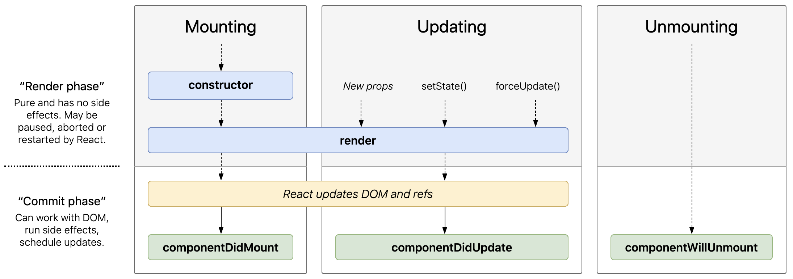

## Props and State

**[Props](https://www.w3schools.com/REACT/react_props.asp)** is short for properties and they are used to pass data between React components. Props are passed to components via **HTML attributes** and they're **read-only**, component cannot change the props. The important part of props is that data with props are being passed in **a uni-directional flow, one way from parent to child**.

```javascript
import React from "react";

class Car extends React.Component {
  render() {
    return (
      <h2>
        There are {this.props.number} {this.props.brand} in garage
      </h2>
    );
  }
}

class Garage extends React.Component {
  render() {
    return (
      <div>
        <h1>What is in my garage?</h1>
        <Car number={2} brand="Ford" />
      </div>
    );
  }
}
```

React has another special built-in object called **[state](https://www.w3schools.com/REACT/react_state.asp)**, which allows components to create and manage their own data. So unlike props, components cannot pass data with state, but they can create and manage it **internally**. State can't be modified directly, but it can be modified with a special method called `setState()`. State updates are merged, when you call `setState()`, React merges the object you provide into the current state. The state of one component will often become the props of a child component.

```javascript
import React, { Component } from "react";
import Car from "./Car";

class App extends Component {
  constructor() {
    super();
    this.state = {
      number: 3,
      name: "Mary",
    };
  }

  increase = () => {
    this.setState({ number: this.state.number + 1 });
  };

  render() {
    return (
      <div>
        <p>{`${this.state.name} has ${this.state.number} cars`}</p>
        <button onClick={this.increase}>+1</button>
        <Car number={this.state.number} brand="Ford" />
      </div>
    );
  }
}
```

```javascript
// wrong
this.state.id = "2020";

// correct
this.setState({
  id: "2020",
});
```

**State** is the local state of the component which cannot be accessed and modified outside of the component, it's similar to variables within a function. **Props** get passed to the component, **make components reusable** by giving components the ability to receive data from their parent component in the form of props, they are similar to function parameters.

Props and State are both plain JavaScript objects. **An update can be caused by changes to props or state.**

## Component

**[Components](https://reactjs.org/docs/components-and-props.html)** let you split the UI into independent, reusable pieces, and think about each piece in isolation. Conceptually, components are like JavaScript functions, they accept arbitrary inputs (called **props**) and return React elements describing what should appear on the screen.

**User-Defined components must be capitalized.** React treats components starting with lowercase letters as built-in DOM tags. For example, `<div />` represents an HTML div tag, but `<Welcome />` correspond to a component defined or imported in scope.

```javascript
// elements that represent DOM tags
const element = <div />;

React.createElement("div");
```

```javascript
// user-defined components must start with a capital letter
const element = <Welcome name="Sara" />;

React.createElement(Welcome, { name: "Sara" });
```

```javascript
// Rendering components
class Welcome extends React.Component {
  render() {
    return <h1>Hello, {this.props.name}</h1>;
  }
}

const element = <Welcome name="Sara" />;

ReactDOM.render(element, document.getElementById("root"));
```

### Make a React component reusable

Component can be tricky to change because of all the nesting, and it is also hard to reuse individual parts of it.

```javascript
// data is hard-coded, can't be reusable
const Avatar = () => {
  return ;
};
```

In order to make component reusable, we have to extract it to its own component. Extracting components might seem like grunt work at first, but having a palette of reusable components pays off in larger apps. A good rule of thumb is that if a part of your UI is **used several times** (Button, Panel, Avatar), or is **complex enough on its own** (App, FeedStory, Comment), it is a good candidate to be extracted to a separate component.

Make a component more reusable by turning it **from specific to more generic**. Naming props **from the component’s own point of view rather than the context in which it is being used**.

```javascript
// before extracting components, all the nesting and hard to reuse individual parts of it
// <Comment author={{ avatarUrl: "https://gravatar.com/avatar/a563115169439b178e10c14b15548961?s=400&d=monsterid&r=x", name: "Jackie" }} text="nice product" />

function Comment(props) {
  return (
    <div className="Comment">
      <div className="UserInfo">
        
        <div className="UserInfo-name">{props.author.name}</div>
      </div>
      <div className="Comment-text">{props.text}</div>
    </div>
  );
}
```

```javascript
// extracting component: Avatar
// The Avatar doesn’t need to know that it is being rendered inside another component
// This is why we have given its prop a more generic name: user rather than author
function Avatar(props) {
  return (
    
  );
}
```

```javascript
// extracting component: UserInfo
function UserInfo(props) {
  return (
    <div className="UserInfo">
      <Avatar user={props.user} />
      <div className="UserInfo-name">{props.user.name}</div>
    </div>
  );
}
```

```javascript
// after extracting components
function Comment(props) {
  return (
    <div className="Comment">
      <UserInfo user={props.author} />
      <div className="Comment-text">{props.text}</div>
    </div>
  );
}
```

☞☞☞☞ [How To Make A React Component Reusable?
](https://www.robinwieruch.de/react-reusable-components)

## Functional component and Class component

### Functional Component

- [Functional components](https://www.robinwieruch.de/react-function-component) are literally JavaScript functions, they are a simpler way to write components that **only contain a render method and don’t have their own state**. They are typically arrow functions but can also be created with the regular function keyword.

- Props are the functional component's parameter, we decide from the outside what it should render or how it should behave, so they're also called Dumb Component, Presentational Component or Stateless Component as **they simply accept data and display them in some form, their only responsibility is to present something to the DOM**.

- Since props are always coming as object, and most often you need to extract the information from the props anyway, JavaScript [object destructuring](https://pjchender.blogspot.com/2017/01/es6-object-destructuring.html) comes in handy.

```javascript
// Functional Component / Arrow Function Component
function Headline() {
  const greeting = "Hello Functional Component!";
  return <h1>{greeting}</h1>;
}

const Welcome = (props) => {
  return <h1>Hello, {props.name}</h1>;
};

const Welcome = ({ name }) => {
  return <h1>Hello, {name}</h1>;
};

const Welcome = (props) => <h1>Hello, {props.name}</h1>;
```

### Class Component

- To define a React class component, you need to **extend React.Component**. The only method you must define in a class component is `render()`, and the return can only return one parent element.

- They're also called Smart Component or Stateful Component as they tend to implement logic and they can maintain their own state. They're more complex than functional component including **constructors, lifecycle methods, render() function and state management**.

```javascript
// Class Component
import React, { Component } from "react";

class Welcome extends Component {
  render() {
    return <h1>Hello, {this.props.name}</h1>;
  }
}
```

## Lifecycle

Each React class component has several [lifecycle methods](https://reactjs.org/docs/react-component.html#the-component-lifecycle) that you can override to run code at particular times in the process.

Commonly used lifecycle methods are:

- **Mounting** – Birth of component, these methods are called in the following order when an instance of a component is being created and inserted into the DOM:

  - constructor()
  - render()
  - componentDidMount()

- **Updating** – Growth of component, re-rendered, an update can be caused by changes to props or state. These methods are called in the following order when a component is being re-rendered:

  - render()
  - componentDidUpdate()

- **Unmounting** – Death of component, this method is called when a component is being removed from the DOM:
  - componentWillUnmount()



### Mounting: constructor ➝ render ➝ componentDidMount

### constructor(props)

The [constructor](https://reactjs.org/docs/react-component.html#constructor) for a React component is called **before it is mounted**. Typically, it's only used for two purposes: initialize local state by assigning an object to this.state and [bind event handler method](https://reactjs.org/docs/handling-events.html) to an instance. So if you don’t do either of them, you don’t need to implement a constructor.

Constructor is the only place where you should assign this.state directly. In all other methods, you need to use this.setState() instead. **Don't call setState() in the constructor().**

```javascript
// with Constructor
// super refers to the parent class constructor (In this example, it points to the React.Component implementation)
// importantly, you can’t use this in a constructor until after you’ve called the parent constructor
class App extends React.Component {
  constructor(props) {
    super(props);
    this.state = { color: "red", count: 0 };
    this.handleOnPress = this.handleOnPress.bind(this);
  }

  handleOnPress() {
    this.setState({ count: this.state.count + 1 });
  }

  render() {
    return (
      <div>
        <h2>
          I have {this.state.count} {this.state.color} Car
        </h2>
        <button onClick={this.handleOnPress}>Click</button>
      </div>
    );
  }
}
```

Note that using a constructor is optional if your Babel setup has support for [class properties](https://babeljs.io/docs/en/babel-plugin-transform-class-properties/), by using class properties you can **initialize local state without using the constructor and declare class methods by using arrow functions without the extra need to bind them**. Class properties are exactly that, properties defined on the class.

```javascript
// without Constructor
// using class properties: babel-plugin-transform-class-properties
class App extends React.Component {
  state = { color: "red", count: 0 };

  handleOnPress = () => {
    this.setState({ count: this.state.count + 1 });
  };

  render() {
    return (
      <div>
        <h2>
          I have {this.state.count} {this.state.color} Car
        </h2>
        <button onClick={this.handleOnPress}>Click</button>
      </div>
    );
  }
}
```

### render()

As the name suggests it handles the component rendering to the UI. It happens during the mounting and updating of component. The [render()](https://reactjs.org/docs/react-component.html#render) function should be pure with no side-effects and will always return the same output when the same inputs are passed, this means that **you can not setState() within a render()**.

The only method you must define in a React class component is render(). All the other lifecycle methods are optional.

```javascript
// A common pattern in React is for a component to return multiple elements.
// Fragments let you group a list of children without adding extra nodes to the DOM.
render() {
  return (
    <React.Fragment>
      <ChildA />
      <ChildB />
      <ChildC />
    </React.Fragment>
  );
}
```

```javascript
// There is a new, shorter syntax you can use for declaring fragments. It looks like empty tags
render() {
  return (
    <>
      <ChildA />
      <ChildB />
      <ChildC />
    </>
  );
}
```

### componentDidMount()

Now your component has been mounted and ready, that’s when the next lifecycle method [componentDidMount()](https://reactjs.org/docs/react-component.html#componentdidmount) comes in play. componentDidMount() is invoked immediately after a component is mounted (inserted into the DOM tree). **If you need to load data from a remote endpoint, this is a good place to instantiate the network request**.

Most common use case for componentDidMount: starting API calls to load in data for your component or all the setup you can't do without a DOM.

```javascript
import React, { Component } from "react";

class App extends Component {
  state = {
    data: [],
  };

  // Code is invoked after the component is inserted into the DOM tree
  componentDidMount() {
    const url =
      "https://en.wikipedia.org/w/api.php?action=opensearch&search=Seona+Dancing&format=json&origin=*";

    fetch(url)
      .then((result) => result.json())
      .then((result) => {
        this.setState({
          data: result,
        });
      });
  }

  render() {
    const { data } = this.state;

    const result = data.map((entry, index) => {
      return <li key={index}>{entry}</li>;
    });

    return <ul>{result}</ul>;
  }
}

export default App;
```

### Updating: render ➝ componentDidUpdate

### componentDidUpdate(prevProps, prevState)

This lifecycle method is invoked as soon as the updating happens. The most common use case for the [componentDidUpdate()](https://reactjs.org/docs/react-component.html#componentDidUpdate) method is **updating the DOM in response to prop or state changes**. This is also a good place to do network requests as long as you compare the current props/state to previous props/state.

**You can call setState() in this lifecycle but note that it must be wrapped in a condition to check for state or prop changes from previous state or you’ll cause an infinite loop**.

```javascript
// check if there has been a change in props from what it currently is
// in this case, there won’t be a need to make the API call if the props did not change.
componentDidUpdate(prevProps) {
  // typical usage, don't forget to compare the props or state!!
  if (this.props.userID !== prevProps.userID) {
    this.fetchData(this.props.userID);
  }
}
```

### Unmounting: componentWillUnmount

### componentWillUnmount()

[componentWillUnmount()](https://reactjs.org/docs/react-component.html#componentWillUnmount) is invoked immediately before a component is unmounted and destroyed. **Perform any necessary cleanup in this method**, such as invalidating timers, canceling network requests, or cleaning up any subscriptions that were created in componentDidMount().

```javascript
componentWillUnmount() {
  window.removeEventListener('resize', this.resizeListener)
  clearInterval(this.interval);
}
```

- References:
  - https://codeburst.io/use-class-properties-to-clean-up-your-classes-and-react-components-93185879f688
  - https://babeljs.io/docs/en/babel-plugin-transform-class-properties/
  - https://programmingwithmosh.com/javascript/react-lifecycle-methods/
  - https://projects.wojtekmaj.pl/react-lifecycle-methods-diagram/
  - https://www.taniarascia.com/getting-started-with-react/
  - [React DevTools for Chrome](https://chrome.google.com/webstore/detail/react-developer-tools/fmkadmapgofadopljbjfkapdkoienihi)
