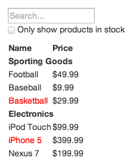
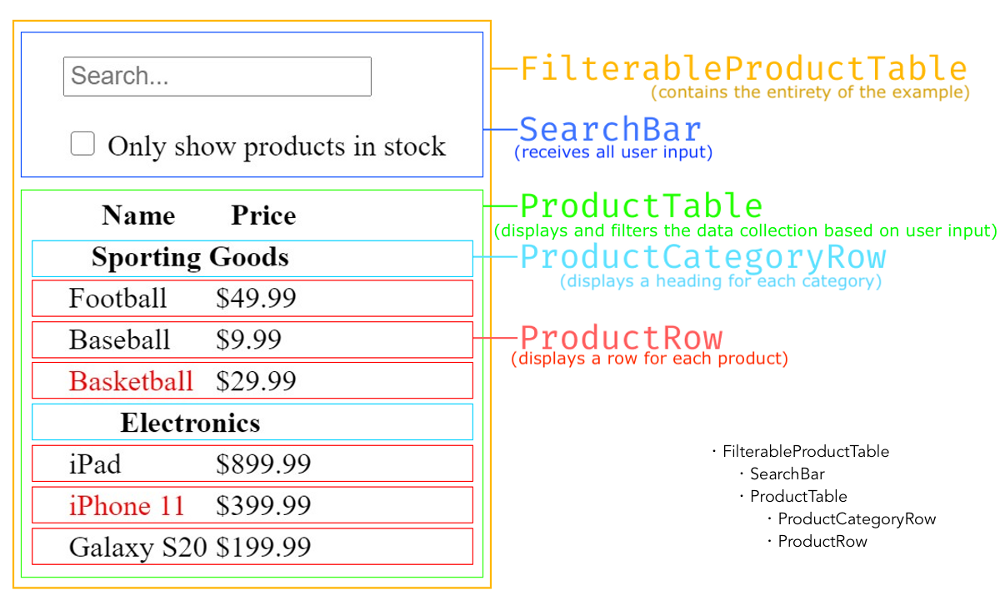

[Thinking in React
](https://reactjs.org/docs/thinking-in-react.html)

Start With A Mock



```
[
  {category: "Sporting Goods", price: "$49.99", stocked: true, name: "Football"},
  {category: "Sporting Goods", price: "$9.99", stocked: true, name: "Baseball"},
  {category: "Sporting Goods", price: "$29.99", stocked: false, name: "Basketball"},
  {category: "Electronics", price: "$99.99", stocked: true, name: "iPod Touch"},
  {category: "Electronics", price: "$399.99", stocked: false, name: "iPhone 5"},
  {category: "Electronics", price: "$199.99", stocked: true, name: "Nexus 7"}
]
```

### Step 1. Break The UI Into A Component Hierarchy

The first thing you’ll want to do when building stuff with React is to **break up your user interface (design) into seperate elements**. Draw boxes around every component (and subcomponent) in the mock and give them all names.

But what should be its own component? One such technique is the [single responsibility principle](https://en.wikipedia.org/wiki/Single-responsibility_principle), that is, a component should ideally only do one thing. If it ends up growing, it should be decomposed into smaller subcomponents.

UI and data models tend to adhere to the same information architecture. If built correctly, your UI component structure and data models will map nicely.




### Step 2. Build A Static Version in React

https://codepen.io/gaearon/pen/BwWzwm

To build a static version of your app that renders your data model, you’ll want to build components that **reuse other components and pass data using props**. props are a way of passing data from parent to child. If you’re familiar with the concept of state, **don’t use state at all to build this static version. State is reserved only for interactivity, that is, data that changes over time**. Since this is a static version of the app, you don’t need it.

At the end of this step, you’ll have reusable components that only have render() methods since this is a static version of your app. You also can see React’s **one-way data flow.**

### Step 3. Identify The Minimal (but complete) Representation Of UI State

To make your UI interactive, you need to be able to **trigger changes to your underlying data model**. React achieves this with **state**. You first need to think of the minimal set of mutable state that your app needs.

Ask three questions about each piece of data to figure out which one is state:

1. Is it passed in from a parent via props? If so, it probably isn’t state.
2. Does it remain unchanged over time? If so, it probably isn’t state.
3. Can you compute it based on any other state or props in your component? If so, it isn’t state.

Think of all of the pieces of data in example application. We have:

- The original list of products: it is passed in as props, so that’s not state
- **The search text the user has entered**: change over time and can’t be computed from anything, it's state
- **The value of the checkbox**: change over time and can’t be computed from anything, it's state
- The filtered list of products: it can be computed by combining the original list of products with the search text and value of the checkbox, so it's not state

### Step 4. Identify Where Your State Should Live

https://codepen.io/gaearon/pen/qPrNQZ?editors=0010

Next, we need to identify which component mutates, or owns, this state.

Remember: React is all about **one-way data flow down the component hierarchy**. It may not be immediately clear which component should own what state. This is often the most challenging part for newcomers to understand.

For each piece of state in your application:

- Identify every component that renders something based on that state.
- Find a common owner component (a single component **above all the components that need the state in the hierarchy**).
- Either the common owner or another component higher up in the hierarchy should own the state.
- If you can’t find a component where it makes sense to own the state, create a new component solely for holding the state and add it somewhere in the hierarchy above the common owner component.

ProductTable needs to filter the product list based on state and SearchBar needs to display the search text and checked state. Their common owner component is **FilterableProductTable**. It conceptually makes sense for the filter text and checked value to live in FilterableProductTable.

### Step 5. Add Inverse Data Flow

https://codepen.io/gaearon/pen/LzWZvb

So far, we’ve built an app that renders correctly as a function of props and state flowing down the hierarchy. Now it’s time to support data flowing the other way: **the form components deep in the hierarchy need to update the state in FilterableProductTable**.

We’ve set the value prop of the input to always be equal to the state passed in from FilterableProductTable so you’ll see that React ignores your input.

**We want to make sure that whenever the user changes the form, we update the state to reflect the user input. Since components should only update their own state, FilterableProductTable will pass callbacks to SearchBar that will fire whenever the state should be updated.** We can use the onChange event on the inputs to be notified of it. The callbacks passed by FilterableProductTable will call setState(), and the app will be updated.
