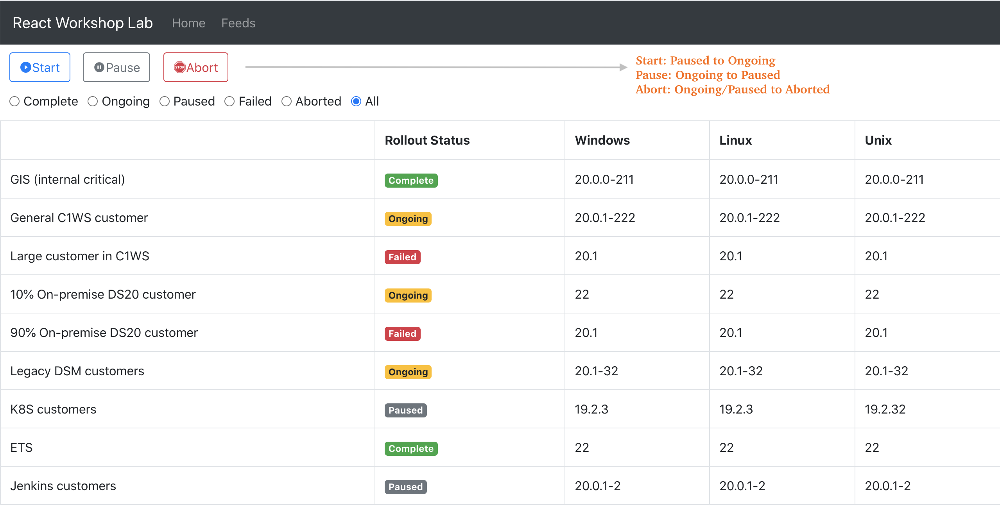
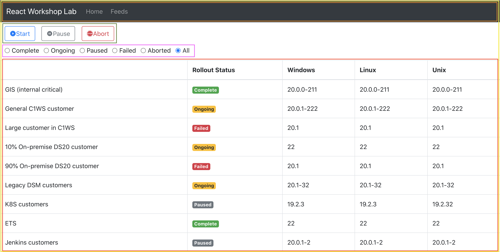

mock-ui




App.js → Header.js

```javascript
import React from "react";
import Navbar from "react-bootstrap/Navbar";
import Nav from "react-bootstrap/Nav";

function App() {
  return (
    <Navbar fixed="top" bg="dark" variant="dark">
      <Navbar.Brand>RELEASE DRIVER</Navbar.Brand>
      <Nav className="mr-auto">
        <Nav.Link href="#home">Home</Nav.Link>
        <Nav.Link href="#feeds">Feeds</Nav.Link>
      </Nav>
    </Navbar>
  );
}

export default App;
```

ActionButtons.js

```javascript
import React from "react";
import Button from "react-bootstrap/Button";

const ActionButtons = () => (
  <>
    <Button variant="outline-primary">Primary</Button>
    <Button variant="outline-secondary">Secondary</Button>
    <Button variant="outline-danger">Danger</Button>
  </>
);

export default ActionButtons;
```

[React Icons](https://react-icons.github.io/react-icons/)

Radios.js

```javascript
import React from "react";
import Form from "react-bootstrap/Form";

const radiosText = [
  "Complete",
  "Ongoing",
  "Paused",
  "Failed",
  "Aborted",
  "All",
];

const Radios = () => (
  <Form>
    <div style={{ margin: "12px" }}>
      {radiosText.map((text) => (
        <Form.Check
          inline
          label={text}
          value={text}
          type="radio"
          key={`radio-show-${text}`}
        />
      ))}
    </div>
  </Form>
);

export default Radios;
```

RingTable.js

```javascript
import React from "react";
import Table from "react-bootstrap/Table";

const RingTable = () => (
  <Table bordered>
    <thead>
      <tr>
        <th></th>
        <th>Rollout Status</th>
        <th>Windows</th>
        <th>Linux</th>
        <th>Unix</th>
      </tr>
    </thead>
    <tbody>
      <tr>
        <td>GIS</td>
        <td>Complete</td>
        <td>20.0.0-211</td>
        <td>20.0.0-211</td>
        <td>20.0.0-211</td>
      </tr>
    </tbody>
  </Table>
);

export default RingTable;
```

mock-api

```
[
  {
    "target": "GIS (internal critical)",
    "status": "Complete",
    "windows": "20.0.0-211",
    "linux": "20.0.0-211",
    "unix": "20.0.0-211"
  },
  {
    "target": "General C1WS customer",
    "status": "Ongoing",
    "windows": "20.0.1-222",
    "linux": "20.0.1-222",
    "unix": "20.0.1-222"
  },
  {
    "target": "Large customer in C1WS",
    "status": "Failed",
    "windows": "20.1",
    "linux": "20.1",
    "unix": "20.1"
  },
  {
    "target": "10% On-premise DS20 customer",
    "status": "Ongoing",
    "windows": "22",
    "linux": "22",
    "unix": "22"
  },
  {
    "target": "90% On-premise DS20 customer",
    "status": "Failed",
    "windows": "20.1",
    "linux": "20.1",
    "unix": "20.1"
  },
  {
    "target": "Legacy DSM customers",
    "status": "Ongoing",
    "windows": "20.1-32",
    "linux": "20.1-32",
    "unix": "20.1-32"
  },
  {
    "target": "K8S customers",
    "status": "Paused",
    "windows": "19.2.3",
    "linux": "19.2.3",
    "unix": "19.2.32"
  },
  {
    "target": "ETS",
    "status": "Complete",
    "windows": "22",
    "linux": "22",
    "unix": "22"
  },
  {
    "target": "Jenkins customers",
    "status": "Paused",
    "windows": "20.0.1-2",
    "linux": "20.0.1-2",
    "unix": "20.0.1-2"
  },
  {
    "target": "Blackduck",
    "status": "Complete",
    "windows": "20",
    "linux": "20",
    "unix": "20"
  },
  {
    "target": "DS TW",
    "status": "Paused",
    "windows": "22.1",
    "linux": "22.1",
    "unix": "22.1"
  },
  {
    "target": "DS CA",
    "status": "Ongoing",
    "windows": "22.2",
    "linux": "22.2",
    "unix": "22.2"
  }
]
```

App.js

```javascript
class App extends Component {
  render() {
    return (
      <>
        <Header theme="dark" brand="RELEASE DRIVER" links={["Home", "Feeds"]} />
        <ActionButtons />
        <Radios />
        <RingTable />
      </>
    );
  }
}
```

```javascript
 state = {
    originalData: [],
    rolloutData: [],
  };

  componentDidMount() {
    fetch("https://run.mocky.io/v3/adc0e655-b26f-4738-a0d8-9cc976a8fa36")
      .then((response) => response.json())
      .then((data) => this.setState({ rolloutData: data, originalData: data }));
  }
```

RingTable.js

```javascript
const getBadgeVariant = (status) => {
  switch (status) {
    case "Complete":
      return "success";

    case "Ongoing":
      return "warning";

    case "Failed":
      return "danger";

    case "Aborted":
      return "dark";

    default:
      return "secondary";
  }
};

const RingTable = ({ rows }) => (
  <Table bordered>
    <thead>
      <tr>
        <th></th>
        <th>Rollout Status</th>
        <th>Windows</th>
        <th>Linux</th>
        <th>Unix</th>
      </tr>
    </thead>
    <tbody>
      {rows.map((row, index) => (
        <tr key={`ring-row-${index}`}>
          <td>{row.target}</td>
          <td>
            <Badge variant={getBadgeVariant(row.status)}>{row.status}</Badge>
          </td>
          <td>{row.windows}</td>
          <td>{row.linux}</td>
          <td>{row.unix}</td>
        </tr>
      ))}
    </tbody>
  </Table>
);
```

App.js

```javascript
state = {
  action: "",
  statusToShow: "All",
};
```
