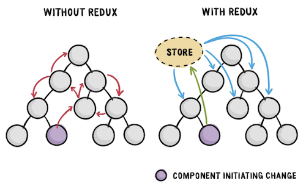
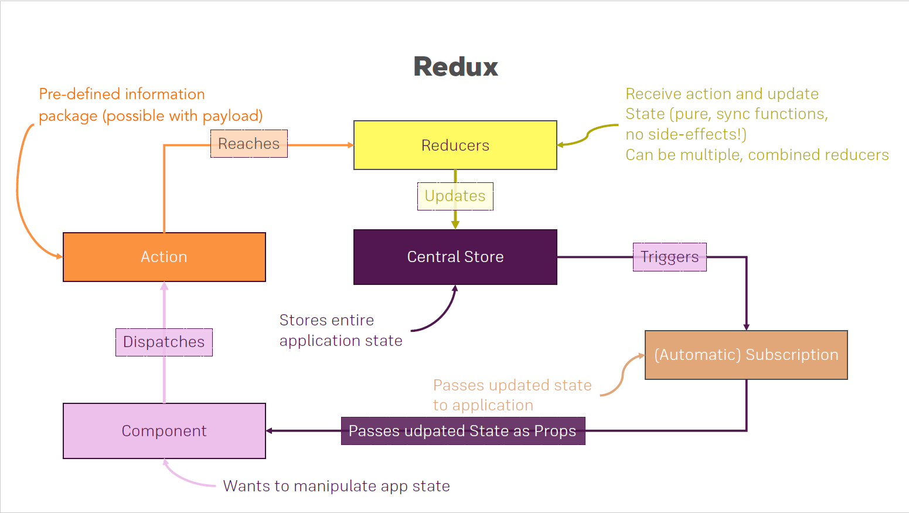

## Redux

### What is Redux?

Redux is a state container for JavaScript applications. Normally with React, you manage state at a component level, and pass state around via props. **With Redux, the entire state of your application is managed in one immutable object**. Every update to the Redux state results in a copy of sections of the state, plus the new change.



### Why should I use Redux?

- Easily manage global state - access or update any part of the state from any Redux-connected component.
- Easily keep track of changes with [Redux DevTools](https://chrome.google.com/webstore/detail/redux-devtools/lmhkpmbekcpmknklioeibfkpmmfibljd) - any action or state change is tracked and easy to follow with Redux. The fact that the entire state of the application is tracked with each change means you can easily do time-travel debugging to move back and forth between changes.

Note: A smaller application [may not need Redux](https://medium.com/@dan_abramov/you-might-not-need-redux-be46360cf367) and may instead benefit from simply using the [Context API](https://reactjs.org/docs/context.html) for global state needs.

### Redux Data Flow

Redux architecture revolves around a **strict unidirectional data flow**. This means that all data in an application follows the same lifecycle pattern, making the logic of your app more predictable and easier to understand.



Basically, Reducers pick up the information from Actions and "reduce" the information to a new state, along with the old state, that is stored in the Store. When state in the Store is changed, the View can act on this by subscribing to the Store.

```js
View -> Action -> Reducer(s) -> Store -> View
```

By using Redux, the state doesn't live in the View anymore, it is only connected to the View. What does connected mean? It is connected on two ends, because it is part of the **unidirectional data flow**. One end is responsible to **trigger an Action** to which updates the state eventually and the second end is responsible to **receive the state** from the Store. Therefore, the View can update accordingly to state changes but can also trigger state changes.

### Redux terminology

`yarn add redux`

### Actions

An action sends data from your application to the Redux store. An action is conventionally an object with two properties: **type and optional payload**.

- The type is generally an uppercase string (assigned to a constant, referred to as **action type**) that describes the action.
- The payload in a Redux action is not mandatory. It is additional data that may be passed, can be anything from a string to an object. You can define actions that have only an action type.

```js
// actio type
const DELETE_TODO = 'DELETE_TODO'
const ADD_TODO = 'ADD_TODO'

// action
{
  type: DELETE_TODO,
  payload: id,
}

{
  type: ADD_TODO,
  todo: { id: '0', name: 'learn redux', completed: false },
}

// action creator: a function that returns an action
const deleteTodo = (id) => ({ type: DELETE_TODO, payload: id })
const addTodo = (todo) => ({ type: ADD_TODO, todo })
```

### Dispatch

**Executing an action is called dispatching in Redux**. You can dispatch an action to change the state in the Redux store. The dispatching of an action can be triggered in your View, it could be as simple as a click on a button.

Dispatch is a method available on the store object that **accepts an object which is used to update the Redux state**. Usually, this object is the result of invoking an action creator.

```js
dispatch(deleteTodo());

dispatch({ type: DELETE_TODO, payload: id });
```

### Reducers

Once an action is dispatched, it will go through **all** reducers in Redux. A reducer is a pure function that takes two parameters: **state and action**. It always produces the same output when the input stays the same. It has no side-effects, thus it is only an input/output operation.

A reducer typically consists of **a switch statement that goes through all the possible action types, and always returns a copy of the entire state.** The reducer reduces - that explains the naming - **the previous state and incoming action to a new state**. It also embraces immutable data structures. It always returns a newState object without mutating the incoming prevState object.

When an action object arrives at the reducers, the action type can be evaluated. Only when a reducer cares about the action type, it will produce a new state. Otherwise, it simply returns the previous state.

```js
(prevState, action) => newState;
```

```js
// not allowed, array push method mutates the previous state instead of returning a new state object
function reducer(state, action) {
  state.push(action.todo);
  return state;
}

// allowed, concat always returns a new array without mutating the old array(previous state)
function reducer(state, action) {
  return state.concat(action.todo);
}
```

```js
const initialState = {
  todos: [
    { id: 1, text: "Eat" },
    { id: 2, text: "Sleep" },
  ],
  loading: false,
  hasErrors: false,
};

function todoReducer(state = initialState, action) {
  switch (action.type) {
    case DELETE_TODO:
      return {
        ...state,
        todos: state.todos.filter((todo) => todo.id !== action.payload),
      };
    case ADD_TODO: {
      return {
        ...state,
        todos: state.todos.concat(action.todo),
      };
    }
    case TOGGLE_TODO: {
      return {
        ...state,
        todos: state.todos.map((todo) =>
          todo.id === action.todo.id
            ? Object.assign({}, todo, { completed: !todo.completed })
            : todo
        ),
      };
    }
    default:
      return state;
  }
}
```

### Store

The Redux application state lives in the store, which is initialized with a reducer. The store holds one global state object. There are no multiple stores.

```js
// the createStore function takes one mandatory argument: a reducer
import { createStore } from "redux";
import rootReducer from "../reducers";

const store = createStore(rootReducer);
```

```js
store.dispatch({
  type: "TODO_ADD",
  todo: { id: "0", name: "learn redux", completed: false },
});

store.getState();
```

### How to combine reducers

As your app grows more complex, you'll want to split your reducing function into separate functions, **each managing independent parts of the state**.

Since the **Redux store takes only one reducer**, you have to combine both of your reducers to one reducer somehow. The `combineReducers` helper function turns an object whose values are different reducing functions into a single reducing function you can pass to `createStore`. The resulting reducer calls every child reducer, and **gathers their results into a single state object**.

**The state produced by combineReducers() namespaces the states of each reducer under their keys as passed to combineReducers()**

```js
import { combineReducers } from "redux";

import languagesReducer from "./languages";
import sessionReducer from "./session";
import uiReducer from "./reducer";
import gatewayReducer from "./gateway";

const rootReducer = combineReducers({
  languages: languagesReducer,
  session: sessionReducer,
  ui: uiReducer,
  gateway: gatewayReducer,
});

export default rootReducer;
```

```js
// store
{
  languages: {...},
  session: {...},
  ui: {...},
  gateway: {...},
}
```

### Connect React with Redux

`yarn add react-redux `

[Redux DevTools Extension](http://extension.remotedev.io/)

### Provider

When used with React, a `<Provider>` exists to wrap the application, which makes the Redux store available to the rest of your app.

```js
import React from "react";
import ReactDOM from "react-dom";
import { Provider } from "react-redux";
import App from "./App";
import store from "./store";

ReactDOM.render(
  <Provider store={store}>
    <App />
  </Provider>,
  document.getElementById("root")
);
```

### Connect

React-Redux provides a `connect` function for you to connect React component to Redux store.

```js
function connect(mapStateToProps?, mapDispatchToProps?, mergeProps?, options?)(ReactComponent)
```

It provides its connected component with the pieces of the data it needs from the store, and the functions it can use to dispatch actions to the store. It does not modify the component class passed to it; instead, it returns a new, connected component class that wraps the component you passed in.

The `mapStateToProps` and `mapDispatchToProps` deals with your Redux store’s state and dispatch, respectively. state and dispatch will be supplied to your mapStateToProps or mapDispatchToProps functions as the first argument.

**mapStateToProps** is used to map a part of the global state as props from the Redux store to the React component. It is a function that can be passed to the `connect` HOC. If it is passed, the input component of the connect HOC will subscribe to updates from the Redux store. Thus, it means that every time the store subscription notices an update, the `mapStateToProps()` function will run.

```js
const mapStateToProps = (state) => ({ todos: state.todos });
```

**mapDispatchToProps** is used to pass dispatchable Redux actions as functions to your React component via props. It is a function (or object) that can be passed to the `connect` HOC. Whereas `mapStateToProps()` gives access to the global state, `mapDispatchToProps()` gives access to the dispatch method of the Redux store. **It makes it possible to dispatch actions but passes down only plain functions that wire up the dispatching in a higher-order function**. After all, it makes it possible to pass functions down to the input component of the connect HOC to alter the state.

```js
const mapDispatchToProps = (dispatch) => {
  return {
    // dispatching plain actions
    increment: () => dispatch({ type: "INCREMENT" }),
    decrement: () => dispatch({ type: "DECREMENT" }),
    reset: () => dispatch({ type: "RESET" }),
  };
};
```

```js
import React from "react";
import { connect } from "react-redux";

// Redux state is now in the props of the component
const PostsPage = ({ loading, posts, hasErrors, listPosts }) => {
  return (
    <section>
      <h1>Posts</h1>
      <button onClick={listPosts} />
    </section>
  );
};
```

```js
const doListPosts = () => ({ type: "LIST_POSTS" });

// Map Redux state to React component props
const mapStateToProps = (state) => ({
  loading: state.posts.loading,
  posts: state.posts.posts,
  hasErrors: state.posts.hasErrors,
});

// Map Redux action to React component props, can dispatch action creatore or plain action object
const mapDispatchToProps = (dispatch) => ({
  listPosts: () => dispatch(doListPosts()),
  dispatchPlainObject: () => dispatch({ type: "MY_ACTION" }),
});

// Connect Redux to React
export default connect(mapStateToProps, mapDispatchToProps)(PostsPage);
```

```js
View -> (mapDispatchToProps) -> Action -> Reducer(s) -> Store -> (mapStateToProps) -> View
```

References:

- https://www.taniarascia.com/redux-react-guide/
- https://www.robinwieruch.de/react-redux-tutorial
