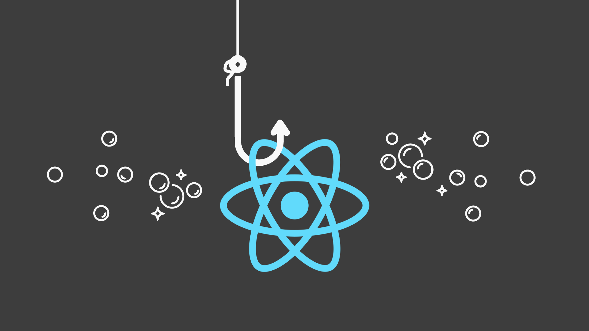

## Hooks



React [Hooks](https://reactjs.org/docs/hooks-intro.html) were introduced in React 16.8. Hooks are functions that let you “hook into” React state and lifecycle methods from function components.

Hooks don’t work inside classes — they let you use React without classes. Whereas function components have been called stateless components before, they are finally able to use state with React Hooks.

- **Completely opt-in.** You can try Hooks in a few components without rewriting any existing code.
- **100% backwards-compatible.** Hooks don’t contain any breaking changes.
- **There are no plans to remove classes from React**. React will keep supporting class components for the foreseeable future.
- **Hooks don’t replace your knowledge of React concepts**, instead, Hooks provide a more direct API to the React concepts you already know: props, state, context, refs, and lifecycle.

## Why Hooks?

### Unnecessary Component Refactorings

Previously, only class components were used for local state management and lifecycle methods. This came with the drawback of refactoring components from function components to class components every time state or lifecycle methods were needed (and vice versa). With Hooks there is no need for this refactoring. Side-effects and state are finally available in function components. Thus, **there is no need to use class components anymore**.

### Complex components become hard to understand

In class components, side-effects were mostly introduced in lifecycle methods (e.g. componentDidMount, componentDidUpdate, componentWillUnmount). A side-effect could be fetching data or interacting with the Browser API. Usually these side-effects came with a setup and clean up phase. Now, if you would introduce more than one of these side-effects in a React class component's lifecycle methods, **all side-effects would be grouped by lifecycle method but not by side-effect.**

**Each lifecycle method often contains a mix of unrelated logic. Mutually related code that changes together gets split apart, but completely unrelated code ends up combined in a single method.** This makes it too easy to introduce bugs and inconsistencies.

Hooks let you split one component into smaller functions based on what pieces are related (such as setting up a subscription or fetching data), rather than forcing a split based on lifecycle methods.

```js
import React, { Component } from 'react';

// side-effects in a class component
class MyComponent extends Component {
  // setup phase
  componentDidMount() {
    // add listener for feature 1
    // add listener for feature 2
  }

  // clean up phase
  componentWillUnmount() {
    // remove listener for feature 1
    // remove listener for feature 2
  }
  ...
}
```

```js
import React, { useEffect } from 'react';

// side-effects in function component with Hooks
function MyComponent() {
  useEffect(() => {
    // add listener for feature 1 (setup)
    // return function to remove listener for feature 1 (clean up)
  });

  useEffect(() => {
    // add listener for feature 2 (setup)
    // return function to remove listener for feature 2 (clean up)
  });
  ...
}
```

### It’s hard to reuse stateful logic between components

With Hooks, you can extract stateful logic from a component so it can be tested independently and reused. Hooks allow you to reuse stateful logic without changing your component hierarchy. This makes it easy to share Hooks among many components.

## State Hook: useState

If you write a function component and realize you need to add some state to it, previously you had to convert it to a class. Now you can use a Hook inside the existing function component. **[useState](https://reactjs.org/docs/hooks-state.html) is a new way to use the exact same capabilities that this.state provides in a class.**

```js
// Equivalent Class Example
class Example extends React.Component {
  state = { count: 0 };

  render() {
    return (
      <div>
        <p>You clicked {this.state.count} times</p>
        <button onClick={() => this.setState({ count: this.state.count + 1 })}>
          Click me
        </button>
      </div>
    );
  }
}
```

```js
import React, { useState } from "react";

function Example() {
  // Declare a new state variable, which we'll call "count"
  const [count, setCount] = useState(0);

  return (
    <div>
      <p>You clicked {count} times</p>
      <button onClick={() => setCount(count + 1)}>Click me</button>
    </div>
  );
}
```

**The useState hook accepts an initial state as argument and returns a pair, by using array destructuring, the current state value and a function that updates it.** This function is similar to this.setState in a class, except it doesn’t merge the old and new state together (with a useState, you can encapsulate each domain) and the state doesn’t have to be an object — although it can be if you want.

The useState hook gives you everything you need to manage state in a function component: initial state, the latest state, and a state update function. Everything else is JavaScript again.

```js
// array destructuring
const fruitStateVariable = useState("banana"); // Returns a pair
const fruit = fruitStateVariable[0]; // First item in a pair
const setFruit = fruitStateVariable[1]; // Second item in a pair

const [fruit, setFruit] = useState("banana");
```

```js
// Declare multiple state variables
function ExampleWithManyStates() {
  const [age, setAge] = useState(42);
  const [fruit, setFruit] = useState("banana");
  const [todos, setTodos] = useState([{ text: "Learn Hooks" }]);
  // ...
}
```

## Effect Hook: useEffect

You’ve likely performed data fetching, subscriptions, or manually changing the DOM from React components before, we call these operations **side effects** (or **effects** for short) because they can affect other components and can’t be done during rendering.

The Effect Hook, **[useEffect](https://reactjs.org/docs/hooks-effect.html)**, adds the ability to perform side effects from function component. **It serves the same purpose as componentDidMount, componentDidUpdate, and componentWillUnmount in React classes, but unified into a single API.**

```js
// Equivalent Class Example
// Note how we have to duplicate the code between these two lifecycle methods in class
class Example extends React.Component {
  state = { count: 0 };

  componentDidMount() {
    document.title = `You clicked ${this.state.count} times`;
  }

  componentDidUpdate() {
    document.title = `You clicked ${this.state.count} times`;
  }

  render() {
    return (
      <div>
        <p>You clicked {this.state.count} times</p>
        <button onClick={() => this.setState({ count: this.state.count + 1 })}>
          Click me
        </button>
      </div>
    );
  }
}
```

```js
import React, { useState, useEffect } from "react";

function Example() {
  const [count, setCount] = useState(0);

  // Similar to componentDidMount and componentDidUpdate
  useEffect(() => {
    // Update the document title using the browser API
    document.title = `You clicked ${count} times`;
  });

  return (
    <div>
      <p>You clicked {count} times</p>
      <button onClick={() => setCount(count + 1)}>Click me</button>
    </div>
  );
}
```

When you call useEffect, you tell React that your component needs to do something after render. Effects are declared inside the component so they have access to its props and state. **By default, React runs the effects after every update — including the first render. Instead of thinking in terms of “mounting” and “updating”, you might find it easier to think that effects happen “after render”.** React guarantees the DOM has been updated by the time it runs the effects.

### Effects with Cleanup

In a React class, you would typically set up a subscription in componentDidMount, and clean it up in componentWillUnmount. **Notice how componentDidMount and componentWillUnmount need to mirror each other. Lifecycle methods force us to split this logic even though conceptually code in both of them is related to the same effect.**

```js
// Equivalent Class Example
class FriendStatus extends React.Component {
  state = { isOnline: null };

  componentDidMount() {
    ChatAPI.subscribeToFriendStatus(
      this.props.friend.id,
      this.handleStatusChange
    );
  }

  componentWillUnmount() {
    ChatAPI.unsubscribeFromFriendStatus(
      this.props.friend.id,
      this.handleStatusChange
    );
  }

  handleStatusChange = (status) => {
    this.setState({
      isOnline: status.isOnline,
    });
  };

  render() {
    if (this.state.isOnline === null) {
      return "Loading...";
    }
    return this.state.isOnline ? "Online" : "Offline";
  }
}
```

**Effects can optionally specify how to “clean up” after them by returning a function**. For example, uses an effect to subscribe to a friend’s online status, and cleans up by unsubscribing from it. React performs the cleanup when the component unmounts.

Hooks let you organize side effects and split the code in a component by what pieces are related (such as adding and removing a subscription), rather than forcing a split based on lifecycle methods. Use multiple effects to separate concerns.

```js
import React, { useState, useEffect } from "react";

function FriendStatus(props) {
  const [isOnline, setIsOnline] = useState(null);

  useEffect(() => {
    function handleStatusChange(status) {
      setIsOnline(status.isOnline);
    }
    ChatAPI.subscribeToFriendStatus(props.friend.id, handleStatusChange);
    // Specify how to clean up after this effect
    return function cleanup() {
      ChatAPI.unsubscribeFromFriendStatus(props.friend.id, handleStatusChange);
    };
  });

  if (isOnline === null) {
    return "Loading...";
  }
  return isOnline ? "Online" : "Offline";
}
```

### Optimizing Performance by Skipping Effects

In some cases, cleaning up or applying the effect after every render might create a performance problem. In class components, we can solve this by writing an extra comparison with prevProps or prevState inside componentDidUpdate.

```js
componentDidUpdate(prevProps, prevState) {
  // forget to wrap in a condition will cause an infinite loop
  if (prevState.count !== this.state.count) {
    document.title = `You clicked ${this.state.count} times`;
  }
}
```

You can tell React to skip applying an effect if certain values haven’t changed between re-renders. To do so, **pass an array as an optional second argument to useEffect**.

```js
useEffect(() => {
  document.title = `You clicked ${count} times`;
}, [count]); // Only re-run the effect if count changes
```

This also works for effects that have a cleanup phase.

```js
useEffect(() => {
  function handleStatusChange(status) {
    setIsOnline(status.isOnline);
  }

  ChatAPI.subscribeToFriendStatus(props.friend.id, handleStatusChange);
  return () => {
    ChatAPI.unsubscribeFromFriendStatus(props.friend.id, handleStatusChange);
  };
}, [props.friend.id]); // Only re-subscribe if props.friend.id changes
```

**If you want to run an effect and clean it up only once (on mount and unmount), you can pass an empty array ([]) as a second argument.** This tells React that your effect **doesn’t depend on any values** from props or state, so it never needs to re-run.

```js
import React, { useState, useEffect } from "react";

function App() {
  const [user, setUser] = useState(null);

  useEffect(() => {
    fetch("https://run.mocky.io/users")
      .then((response) => response.json())
      .then((data) => {
        setUser(data.users[0]);
      });
  }, []); // Pass empty array to only run once on mount

  return <div>{user ? user.name : "Loading..."}</div>;
}
```

## Rules of Hooks

- Only call Hooks **from React function components**. Don’t call Hooks from regular JavaScript functions.

- **Only Call Hooks at the Top Level. Don’t call Hooks inside loops, conditions, or nested functions**. React relies on the order in which Hooks are called. By following this rule, you ensure that Hooks are called in the same order each time a component renders. That’s what allows React to correctly associate the state of Hooks between multiple useState and useEffect calls.

```js
function Form() {
  // 1. Use the name state variable
  const [name, setName] = useState("Mary");

  // 2. Use an effect for persisting the form
  useEffect(function persistForm() {
    localStorage.setItem("formData", name);
  });

  // 3. Use the surname state variable
  const [surname, setSurname] = useState("Poppins");

  // 4. Use an effect for updating the title
  useEffect(function updateTitle() {
    document.title = name + " " + surname;
  });
  ...
}
```

```js
// First render
useState("Mary"); // 1. Initialize the name state variable with 'Mary'
useEffect(persistForm); // 2. Add an effect for persisting the form
useState("Poppins"); // 3. Initialize the surname state variable with 'Poppins'
useEffect(updateTitle); // 4. Add an effect for updating the title

// Second render
useState("Mary"); // 1. Read the name state variable (argument is ignored)
useEffect(persistForm); // 2. Replace the effect for persisting the form
useState("Poppins"); // 3. Read the surname state variable (argument is ignored)
useEffect(updateTitle); // 4. Replace the effect for updating the title
```

```js
// 🔴 We're breaking the rule by using a Hook in a condition
if (name !== "") {
  useEffect(function persistForm() {
    localStorage.setItem("formData", name);
  });
}

useState("Mary"); // 1. Read the name state variable (argument is ignored)
// useEffect(persistForm)  // 🔴 This Hook was skipped!
useState("Poppins"); // 🔴 2 (but was 3). Fail to read the surname state variable
useEffect(updateTitle); // 🔴 3 (but was 4). Fail to replace the effect

// If we want to run an effect conditionally, we can put that condition inside Hook
useEffect(function persistForm() {
  // 👍 We're not breaking the rule anymore
  if (name !== "") {
    localStorage.setItem("formData", name);
  }
});
```

## Building Your Own Hooks

Building your own Hooks lets you extract component logic into reusable functions.

```js
// a chat application that displays a message indicating whether a friend is online or offline
import React, { useState, useEffect } from "react";

function FriendStatus(props) {
  const [isOnline, setIsOnline] = useState(null);

  useEffect(() => {
    function handleStatusChange(status) {
      setIsOnline(status.isOnline);
    }

    ChatAPI.subscribeToFriendStatus(props.friend.id, handleStatusChange);
    return () => {
      ChatAPI.unsubscribeFromFriendStatus(props.friend.id, handleStatusChange);
    };
  });

  if (isOnline === null) {
    return "Loading...";
  }
  return isOnline ? "Online" : "Offline";
}
```

```js
// a contact list renders names of online users with a green color
import React, { useState, useEffect } from "react";

function FriendListItem(props) {
  const [isOnline, setIsOnline] = useState(null);

  useEffect(() => {
    function handleStatusChange(status) {
      setIsOnline(status.isOnline);
    }

    ChatAPI.subscribeToFriendStatus(props.friend.id, handleStatusChange);
    return () => {
      ChatAPI.unsubscribeFromFriendStatus(props.friend.id, handleStatusChange);
    };
  });

  return (
    <li style={{ color: isOnline ? "green" : "black" }}>{props.friend.name}</li>
  );
}
```

**A custom Hook is a JavaScript function whose name starts with _use_ and that may call other Hooks.**

```js
import { useState, useEffect } from "react";

function useFriendStatus(friendID) {
  const [isOnline, setIsOnline] = useState(null);

  useEffect(() => {
    function handleStatusChange(status) {
      setIsOnline(status.isOnline);
    }

    ChatAPI.subscribeToFriendStatus(friendID, handleStatusChange);
    return () => {
      ChatAPI.unsubscribeFromFriendStatus(friendID, handleStatusChange);
    };
  });

  return isOnline;
}
```

Reuse stateful logic between components.

```js
function FriendStatus(props) {
  const isOnline = useFriendStatus(props.friend.id);

  if (isOnline === null) {
    return "Loading...";
  }
  return isOnline ? "Online" : "Offline";
}

function FriendListItem(props) {
  const isOnline = useFriendStatus(props.friend.id);

  return (
    <li style={{ color: isOnline ? "green" : "black" }}>{props.friend.name}</li>
  );
}
```

## React Redux Hooks

React Redux now offers a set of [hook APIs](https://react-redux.js.org/api/hooks) as an alternative to the existing `connect()` Higher Order Component. These APIs allow you to subscribe to the Redux store and dispatch actions, without having to wrap your components in `connect()`. These hooks were first added in v7.1.0.

### useSelector()

```js
const result = useSelector(selector);
```

Allows you to extract data from the Redux store state, using a selector function. The selector is approximately equivalent to the `mapStateToProps` argument to `connect` conceptually. The selector will be called with the entire Redux store state as its only argument.

```js
import React from "react";
import { useSelector } from "react-redux";

export const CounterComponent = () => {
  const counter = useSelector((state) => state.counter);
  return <div>{counter}</div>;
};
```

### useDispatch()

```js
const dispatch = useDispatch();
```

This hook returns a reference to the **dispatch** function from the Redux store. You may use it to dispatch actions as needed.

```js
import React from "react";
import { useDispatch } from "react-redux";

export const CounterComponent = ({ value }) => {
  const dispatch = useDispatch();

  return (
    <div>
      <span>{value}</span>
      <button onClick={() => dispatch({ type: "increment-counter" })}>
        Increment counter
      </button>
    </div>
  );
};
```
